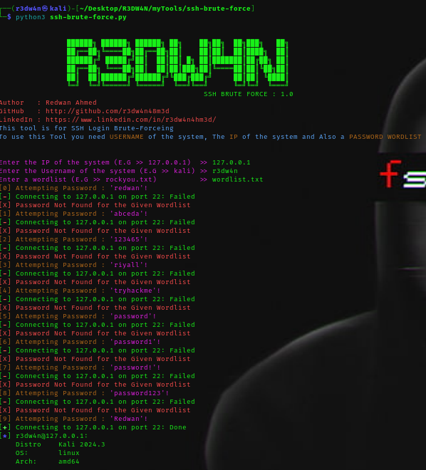

<pre align="center"><h6>
███████╗███████╗██╗  ██╗      ██████╗ ██████╗ ██╗   ██╗████████╗███████╗    ███████╗ ██████╗ ██████╗  ██████╗███████╗██████╗ 
██╔════╝██╔════╝██║  ██║      ██╔══██╗██╔══██╗██║   ██║╚══██╔══╝██╔════╝    ██╔════╝██╔═══██╗██╔══██╗██╔════╝██╔════╝██╔══██╗
███████╗███████╗███████║█████╗██████╔╝██████╔╝██║   ██║   ██║   █████╗█████╗█████╗  ██║   ██║██████╔╝██║     █████╗  ██████╔╝
╚════██║╚════██║██╔══██║╚════╝██╔══██╗██╔══██╗██║   ██║   ██║   ██╔══╝╚════╝██╔══╝  ██║   ██║██╔══██╗██║     ██╔══╝  ██╔══██╗
███████║███████║██║  ██║      ██████╔╝██║  ██║╚██████╔╝   ██║   ███████╗    ██║     ╚██████╔╝██║  ██║╚██████╗███████╗██║  ██║
╚══════╝╚══════╝╚═╝  ╚═╝      ╚═════╝ ╚═╝  ╚═╝ ╚═════╝    ╚═╝   ╚══════╝    ╚═╝      ╚═════╝ ╚═╝  ╚═╝ ╚═════╝╚══════╝╚═╝  ╚═╝
</h6><br>
</pre>

<h4 align="center">A Tool for SSH Brute Forcing</h4>


<p align="center">
<a href="https://github.com/r3dw4n48m3d/ssh-brute-forcer/issues"></a>
<a href="https://x.com/r3dw4n48m3d"></a>
<a href="https://discord.gg/ncwDbrny"></a>
</p>

<p align="center">
  <a href="#features">Features</a> •
  <a href="#installation">Install</a> •
  <a href="https://discord.gg/ncwDbrny">Join Discord</a>
</p>

---


`ssh-brute-forcer` is a brute force tool for ssh connection. It has a simple tool with some input function. `ssh-brute-forcer` is built for
doing one thing only - brute-forcing ssh, and it does that very well.

# Features

<h1 align="left">
  </a>
  <br>
</h1>

- Easy to use
- Colorful Output
- Lightweight

# Usage

```sh
python3 ssh-brute-force.py
```

This will display help for the tool.

```yaml


                ██████╗ ██████╗ ██████╗ ██╗    ██╗██╗  ██╗███╗   ██╗
                ██╔══██╗╚════██╗██╔══██╗██║    ██║██║  ██║████╗  ██║
                ██████╔╝ █████╔╝██║  ██║██║ █╗ ██║███████║██╔██╗ ██║
                ██╔══██╗ ╚═══██╗██║  ██║██║███╗██║╚════██║██║╚██╗██║
                ██║  ██║██████╔╝██████╔╝╚███╔███╔╝     ██║██║ ╚████║
                ╚═╝  ╚═╝╚═════╝ ╚═════╝  ╚══╝╚══╝      ╚═╝╚═╝  ╚═══╝
                                                SSH BRUTE FORCE : 1.0
Author   : Redwan Ahmed 
GitHub   : http://github.com/r3dw4n48m3d 
LinkedIn : https://www.linkedin.com/in/r3dw4n4hm3d/
This tool is for SSH Login Brute-Forceing
To use this Tool you need USERNAME of the system, The IP of the system and Also a PASSWORD WORDLIST 


Enter the IP of the system (E.G >> 127.0.0.1)  >> 127.0.0.1
Enter the Username of the system (E.G >> kali) >> kali
Enter a wordlist (E.G >> rockyou.txt)          >> usr/share/wordlists/rockyou.txt

```

# Installation

`ssh-brute-force.py` requires **some pip moddules** to install successfully. Run the following command to install the latest version:

```sh
git clone https://github.com/r3dw4n48m3d/ssh-brute-forcer.git
cd ssh-brute-forcer
pip install -r requirements.txt
python3 ssh-brute-force.py
```


</td>
</tr>
</table>

# License

`ssh-brute-forcer` is made with 🖤 by the Redwan Ahmed.
